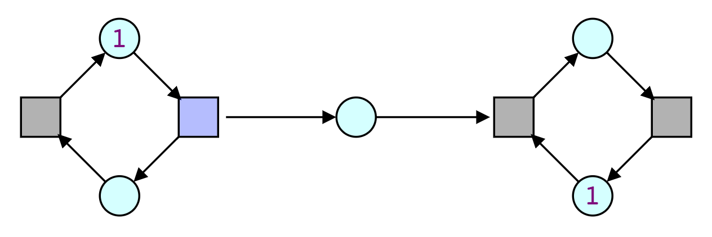
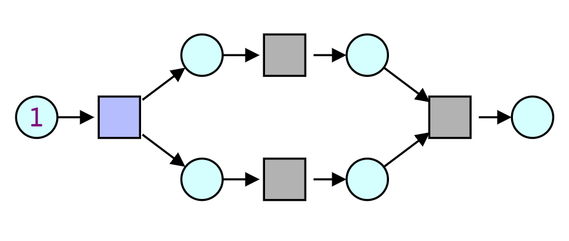

> Welcome to Petrinet.Info

# Example Nets

## Producer Consumer Net

> what's the point

## Split-Join

> what's the point

## Pawel

> Exponential growth

## Confusion

> Confusion in petri nets

# Related Things

- Event Structures
  http://www.cl.cam.ac.uk/~gw104/EvStr.pdf

- Removing Confusion
  https://arxiv.org/pdf/1710.04570.pdf

- Pawel Sobocinski
  https://www.semanticscholar.org/paper/Representations-of-Petri-Net-Interactions-Sobocinski/5af3fa656639d55afdfde980a74878c1d0a84ba8

----

#### Maintaining

- [edit](https://github.com/PetriNets/petrinets.github.io/edit/master/index.md)
- [markdown guide](https://guides.github.com/features/mastering-markdown/).
